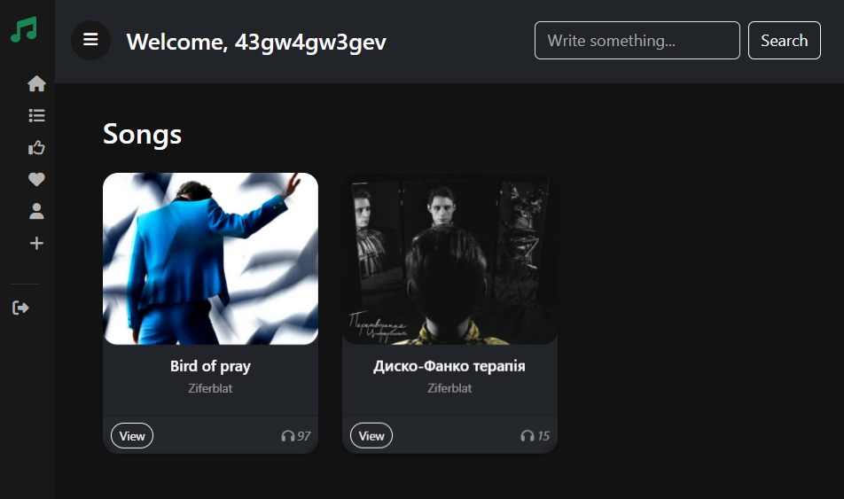
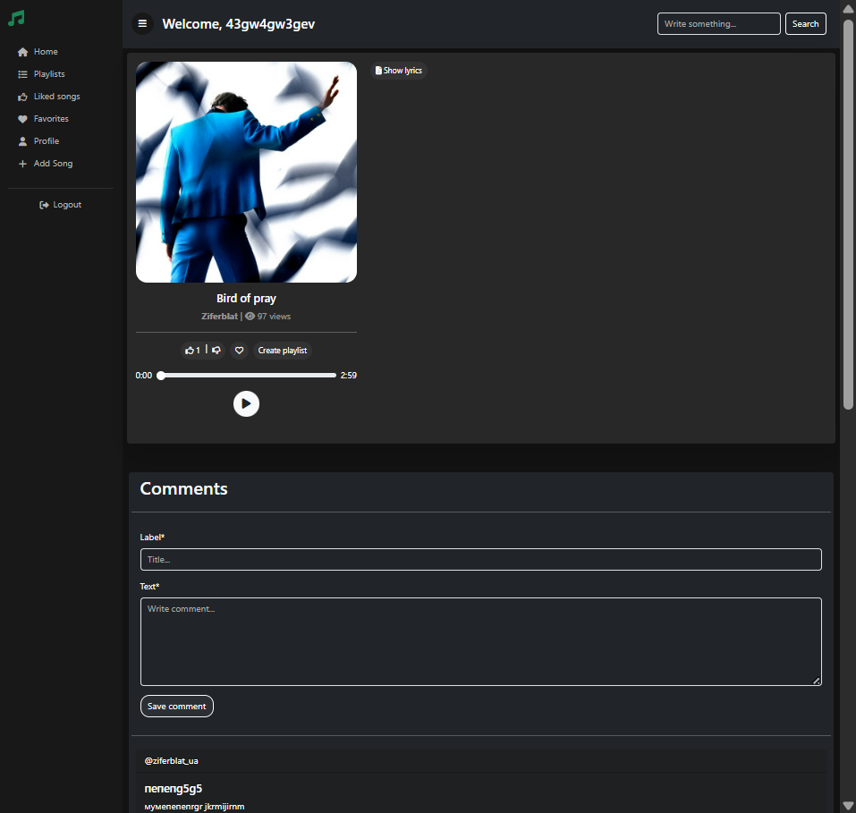

<h1>Music Service Django Project</h1>

Music Service is a professional web application for managing, listening to, and sharing music. It provides comprehensive features including playlist creation, song management, user profiles, favorites, likes, analytics, and a responsive interface. The project is built on <strong>Django 5.2.5</strong> with <strong>Bootstrap 5</strong> and <strong>Font Awesome</strong>, utilizing <strong>PostgreSQL</strong> for database management.

<h2>Main Features</h2>
<ul>
    <li>Create, edit, and delete playlists with custom titles.</li>
    <li>Add, edit, and remove songs with metadata (title, author, cover image, release status).</li>
    <li>Like songs and mark as favorites.</li>
    <li>View popular, recently released, and recommended songs.</li>
    <li>User authentication: registration, login, logout, and profile management.</li>
    <li>Admin interface for managing users, songs, playlists, and analytics.</li>
    <li>AJAX-based operations for removing favorites and liked songs without page reloads.</li>
    <li>Pagination for large lists of songs and playlists.</li>
    <li>Responsive design for desktop and mobile.</li>
</ul>

<h2>Installation</h2>
<ol>
    <li>Clone the repository: <code>git clone https://github.com/yourusername/music-service.git</code></li>
    <li>Create and activate a virtual environment:
        <ul>
            <li>Windows: <code>python -m venv venv &amp;&amp; venv\Scripts\activate</code></li>
            <li>Linux/Mac: <code>python -m venv venv &amp;&amp; source venv/bin/activate</code></li>
        </ul>
    </li>
    <li>Install dependencies: <code>pip install -r requirements.txt</code></li>
    <li>Run migrations: <code>python manage.py migrate</code></li>
    <li>Create a superuser: <code>python manage.py createsuperuser</code></li>
    <li>Start the development server: <code>python manage.py runserver</code></li>
</ol>

<h2>Usage</h2>

Access the application at <a href="http://127.0.0.1:8000/">http://127.0.0.1:8000/</a>. Users can:

<ul>
    <li>Browse all songs and view detailed song pages.</li>
    <li>Create personal playlists and manage their content.</li>
    <li>Like or favorite songs and remove them via AJAX.</li>
    <li>Track song popularity through view counts.</li>
    <li>Search for songs and filter by author, title, or playlist.</li>
</ul>

<h2>Technologies</h2>
<ul>
    <li>Python 3.13</li>
    <li>Django 5.2.5</li>
    <li>Bootstrap 5</li>
    <li>Font Awesome</li>
    <li>JavaScript for AJAX operations</li>
    <li>Sqlite3</li>
</ul>

<h2>Project Structure</h2>
<ul>
    <li><code>music_saver/</code> — main Django app with models, views, templates, and static files</li>
    <li><code>templates/music_saver/</code> — HTML templates for pages like home, favorites, playlists, and song views</li>
    <li><code>Music_Service/media</code> — audio and images</li>
    <li><code>urls.py</code> — all URL routes and namespace definitions</li>
    <li><code>forms.py</code> — Django forms for adding/editing songs and playlists</li>
    <li><code>models.py</code> — database models for Songs, Playlists, and Users</li>
</ul>

<h2>License</h2>

This project is licensed under the MIT License.

<h2>Screenshots</h2>

Main interface:

Song page:

